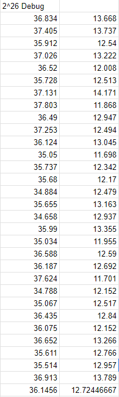

# Tan, Edward James E
## S11 - LBYARCH

## Comparative Execution Time and Performance Analysis

### Debug Mode (C and x86-64)

Across all tests, the x86-64 assembly version of the program performed far more efficiently than the C program by a large margin. The averages of the different vector sizes 
are as follows:

  

### Release Mode (C and x86-64)

Provide comparative execution times and a short analysis of the performance of the kernels in release mode for both C and x86-64.

## Screenshots

### C Program Output with Correctness Check

![Program Output]

Include a screenshot of the program output with the correctness check for the C program.

### x86-64 Program Output with Correctness Check

Include a screenshot of the program output with the correctness check for the x86-64 program.

## License

Information about the project's license.

