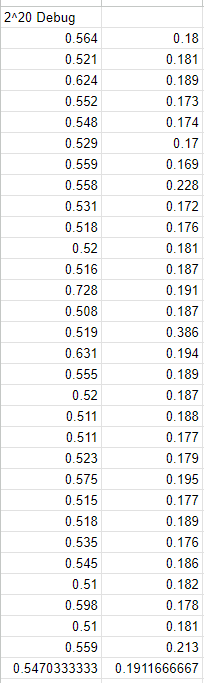
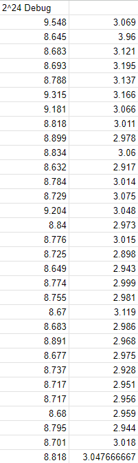
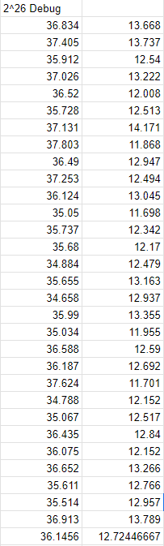
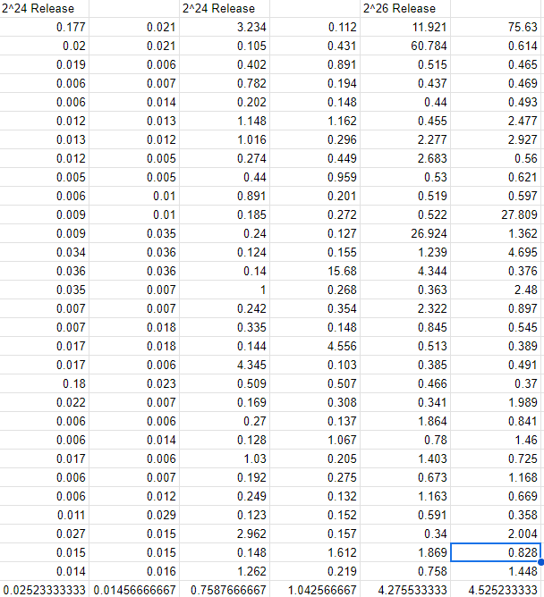
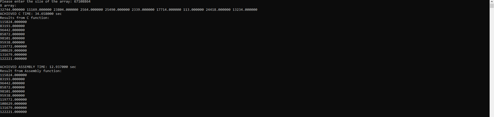

# Tan, Edward James E
## S11 - LBYARCH

## Comparative Execution Time and Performance Analysis

### Debug Mode (C and x86-64)

Across all tests, the x86-64 assembly version of the program performed far more efficiently than the C program by a large margin. The averages of the different vector sizes 
are as follows (C in left, x86-64 in right row):

  

### Release Mode (C and x86-64)

Compared to the debug version, the release version had a closer difference between C and x86-64, with mostly a few decimals difference between the two.

## Screenshots

### C Program and x86-64 Output with Correctness Check

